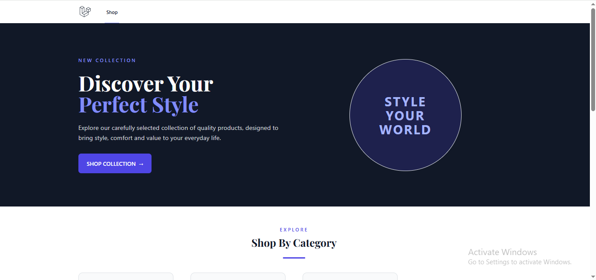
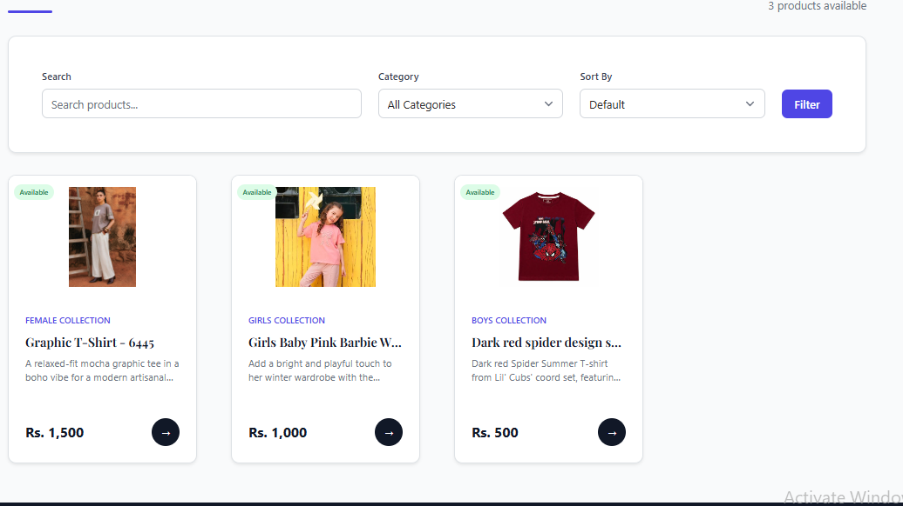
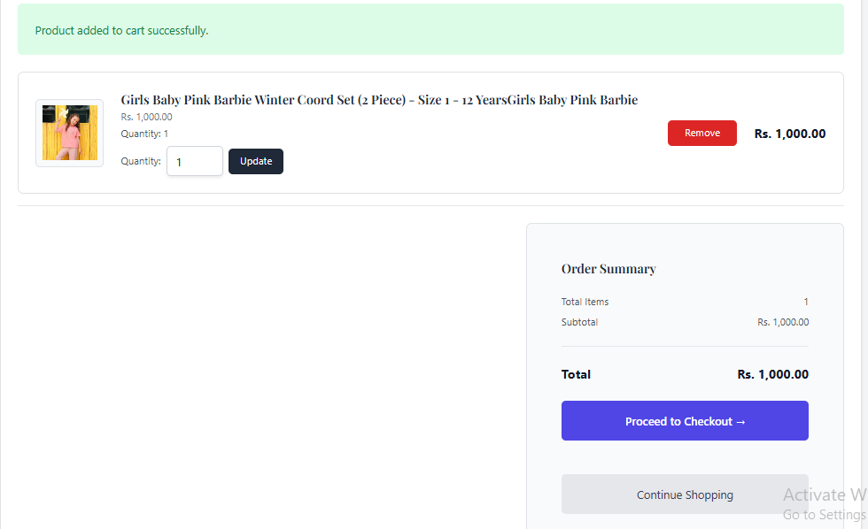
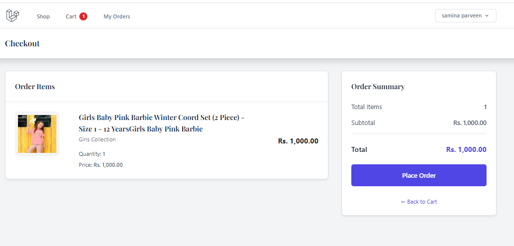
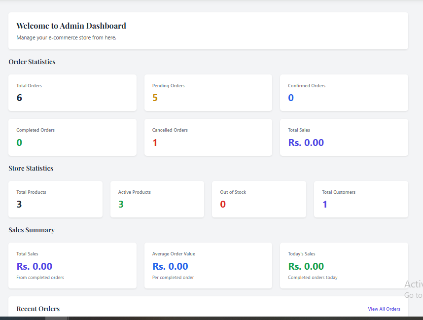
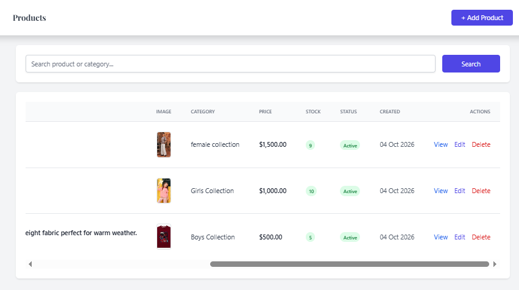
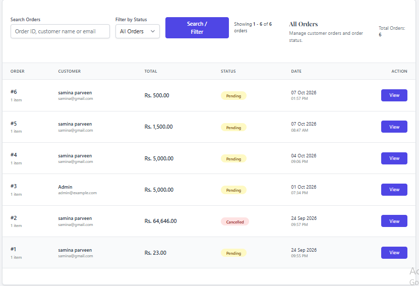

# Laravel E-Commerce Management System

## 🌐 Live Demo

**Live Website:** https://ecomerceshop.site.je/shop

A full-featured **E-Commerce Management System** built with **Laravel 9**, designed to demonstrate real-world web application development, including product management, categories, product images, shopping cart, checkout, orders, authentication, and an admin panel.

This project was developed as a portfolio project to demonstrate practical **Laravel, PHP, MySQL, MVC, CRUD, authentication, database relationships, file/image management, and responsive UI** development skills.

### Demo Credentials

| Role     | Email               | Password      |
| -------- | ------------------- | ------------- |
| Admin    | `admin@example.com` | `Admin@12345` |
| Customer | `samina@gmail.com`  | `samina12345` |

**Note:** Demo credentials ko live website par login karke verify karein. Ye accounts sirf testing ke liye hon aur in par sensitive data na ho.


---

## 🚀 Features

### 👤 Customer Features

* User registration and login
* User authentication
* Browse products
* View product details
* Browse products by category
* Product search
* Product images
* Add products to cart
* Update cart quantities
* Remove products from cart
* Checkout
* Place orders
* View order information
* Customer dashboard
* Profile management

### 🛠️ Admin Features

* Admin dashboard
* Category management
* Create, edit and delete categories
* Product management
* Create, edit and delete products
* Product image upload and management
* Product pricing management
* Product stock management
* Product status management
* Order management
* View customer orders
* Update order status
* Admin authentication and access control

### 🛒 Shopping & Order Management

* Shopping cart system
* Cart quantity management
* Product price calculation
* Checkout process
* Order creation
* Order details
* Order status management
* Customer order history

---

## 💻 Technologies Used

* **PHP**
* **Laravel 9.52.22**
* **MySQL**
* **Blade Templates**
* **Laravel Eloquent ORM**
* **HTML5**
* **CSS3**
* **JavaScript**
* **Tailwind CSS**
* **Vite**
* **Git & GitHub**

---

## 🏗️ Project Architecture

The application follows the **MVC (Model-View-Controller)** architecture provided by Laravel.

### Main Components

* **Models** — Database interaction and relationships
* **Controllers** — Application/business logic
* **Blade Views** — User interface
* **Migrations** — Database structure
* **Middleware** — Authentication and admin access control
* **Routes** — Application URL and request handling
* **Storage** — Product image management

---

## 📦 Main Modules

### Authentication

Users can register, login, logout and manage their profile through the authentication system.

### Categories

Administrators can:

* Create categories
* Edit categories
* Delete categories
* Manage category information

### Products

Administrators can manage:

* Product name
* Description
* Price
* Stock
* Category
* Product image
* Product status

Customers can browse products and view detailed product information.

### Shopping Cart

Customers can:

* Add products to cart
* Change product quantity
* Remove products
* View cart totals

### Checkout

The checkout module allows customers to review their cart and place orders.

### Orders

Customers can view their orders, while administrators can manage orders and update their status.

---

## 🖼️ Product Image Management

The system includes product image upload and display functionality.

Uploaded product images are stored using Laravel's storage system and displayed dynamically throughout the application.

---

## 🔐 Access Control

The application uses Laravel authentication and middleware to separate customer and administrator functionality.

### Customer

Customers can access:

* Products
* Product details
* Cart
* Checkout
* Orders
* Profile

### Administrator

Administrators can access:

* Admin Dashboard
* Categories
* Products
* Orders

---

## ⚙️ Installation

Follow these steps to set up and run the Laravel E-Commerce Management System locally.

### 1. Clone the Repository

```bash
git clone https://github.com/samina2108/laravel-ecommerce-management-system.git
cd laravel-ecommerce-management-system
```

### 2. Install PHP Dependencies

```bash
composer install
```

### 3. Create the Environment File

Copy `.env.example` to `.env`.

**Windows (Command Prompt):**

```bash
copy .env.example .env
```

**macOS / Linux:**

```bash
cp .env.example .env
```

### 4. Generate the Application Key

```bash
php artisan key:generate
```

### 5. Configure the Database

Create a MySQL database using phpMyAdmin or your preferred MySQL tool.

Open `.env` and update these settings with your own database credentials:

```env
DB_CONNECTION=mysql
DB_HOST=127.0.0.1
DB_PORT=3306
DB_DATABASE=your_database_name
DB_USERNAME=your_database_username
DB_PASSWORD=your_database_password
```

### 6. Run Database Migrations

```bash
php artisan migrate
```

### 7. Create the Storage Link

```bash
php artisan storage:link
```

This enables Laravel to serve uploaded product images from the public storage directory.

### 8. Install Frontend Dependencies

Make sure Node.js and npm are installed, then run:

```bash
npm install
```

### 9. Start the Development Environment

Open two terminals in the project directory.

**Terminal 1 — Vite development server:**

```bash
npm run dev
```

**Terminal 2 — Laravel development server:**

```bash
php artisan serve
```

Open the application at:

http://127.0.0.1:8000

### Production Frontend Build

To compile frontend assets for deployment, run:

```bash
npm run build
```

For local development, use `npm run dev`. For production deployment, build the assets with `npm run build`.

---

## 🗄️ Database

This project uses **MySQL** to store application data.

Laravel migrations define the database structure. Configure your database credentials in `.env` before running the migrations.

**Note:** If the project requires demo records, seeders must be available and configured before running any database seeding commands.


## 📸 Screenshots

### 🛍️ Shop



### 📦 Product Details



### 🛒 Shopping Cart



### 💳 Checkout



### 📊 Admin Dashboard



### 📦 Admin Products



### 🧾 Admin Orders




### Customer Website

* Home Page
* Products Page
* Product Details
* Shopping Cart
* Checkout
* Orders

### Admin Panel

* Admin Dashboard
* Category Management
* Product Management
* Order Management

---

## 📁 Project Structure

```text
app/
├── Http/
│   ├── Controllers/
│   └── Middleware/
├── Models/

database/
├── migrations/
└── seeders/

resources/
├── views/
├── css/
└── js/

routes/
└── web.php

storage/
└── app/
```

---

## 🔧 Useful Laravel Commands

Run migrations:

```bash
php artisan migrate
```

Create storage link:

```bash
php artisan storage:link
```

Clear application cache:

```bash
php artisan optimize:clear
```

Start development server:

```bash
php artisan serve
```

---

## 🎯 Project Purpose

This project was developed as a **professional Laravel portfolio project** to demonstrate practical experience in building a complete e-commerce web application.

It demonstrates:

* Laravel MVC architecture
* CRUD operations
* Authentication
* Authorization
* MySQL database integration
* Eloquent relationships
* Product management
* Image upload and storage
* Shopping cart functionality
* Checkout and order management
* Admin panel
* Responsive user interface
* Git and GitHub workflow

---

## 👩‍💻 Developer

**Samina Parveen**

Laravel / PHP Developer

GitHub:
https://github.com/samina2108

---

## 📄 License

This project is developed for portfolio and learning purposes.
